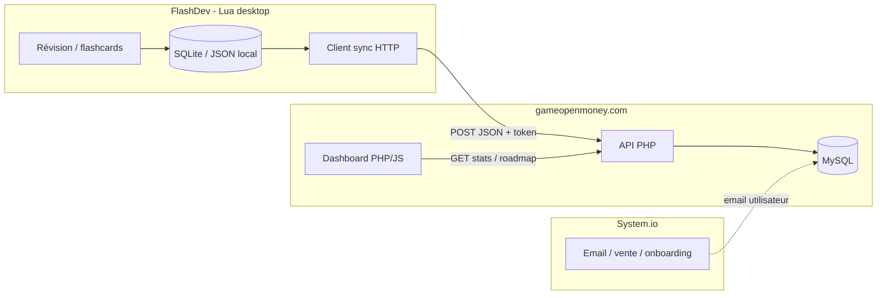

# Architecture FlashDev ↔ Site web

> Document créé le 21 juin 2026  
> Objectif : relier le logiciel FlashDev (Lua) au site [gameopenmoney.com](https://gameopenmoney.com/) pour la **roadmap utilisateur** (Module A) et les **statistiques / classement** (Module B).

---

## 1. Les deux projets GitHub

| Projet | Rôle | Stack | Dépôt |
|--------|------|-------|-------|
| **madhackademyWebSite** | Site vitrine + futur dashboard élève | HTML, Tailwind, PHP (à venir), MySQL | [github.com/madhackademie/madhackademyWebSite](https://github.com/madhackademie/madhackademyWebSite) |
| **FlashRevisionSoft** | Logiciel desktop de flashcards « learn by doing » (FlashDev) | Lua / LÖVE2D | [github.com/madhackademie/FlashRevisionSoft](https://github.com/madhackademie/FlashRevisionSoft) |

**Production actuelle :**
- Accueil : [https://gameopenmoney.com/](https://gameopenmoney.com/)
- Centre formation : [https://gameopenmoney.com/centre-formation.html](https://gameopenmoney.com/centre-formation.html)

---

## 2. Comment lier les deux projets (pour le travail avec Cursor / l’IA)

Le site et le soft sont dans **deux dépôts Git séparés**. Pour que l’assistant puisse travailler sur les deux en même temps :

### Option A — Workspace multi-dossiers (recommandé)

1. Cloner le dépôt FlashDev à côté du site :
   ```
   CentreFormationMadHackAdemyInternetSite/
   ├── madhackademyWebSite/     ← site HTML (ce dépôt)
   └── FlashRevisionSoft/       ← soft Lua LÖVE2D (autre dépôt)
   ```
2. Dans Cursor : **File → Add Folder to Workspace…** → ajouter le dossier `FlashRevisionSoft`
3. Sauvegarder le workspace : **File → Save Workspace As…** → `madhackademy.code-workspace`

L’IA aura accès aux deux dossiers et pourra modifier le client HTTP Lua **et** l’API PHP du site.

### Option B — Dossier parent unique

Ouvrir directement `CentreFormationMadHackAdemyInternetSite/` comme racine Cursor (au lieu d’un seul sous-dossier). Les deux projets apparaissent dans l’explorateur de fichiers.

### Option C — Référence dans ce dépôt (documentation)

Ajouter dans ce dépôt un fichier `.cursor/rules` ou une section README avec :
- URL du dépôt FlashDev
- Chemin local attendu (`../FlashRevisionSoft/`)
- Rôle de chaque projet

→ Permet à l’IA de savoir où chercher même si un seul dossier est ouvert, **à condition** que l’autre repo soit cloné au chemin indiqué.

### Option D — Git submodule (avancé)

Intégrer FlashDev comme submodule dans madhackademyWebSite :
```bash
git submodule add https://github.com/madhackademie/FlashRevisionSoft.git soft/FlashRevisionSoft
```
Utile pour versionner explicitement quelle version du soft correspond au site. Plus lourd à maintenir pour un début.

### Ce qu’il faut fournir à l’IA

Quand tu demandes une feature transversale (sync stats, appairage, etc.), indique :
1. L’**URL GitHub** du soft Lua
2. Le **chemin local** si les deux dossiers sont ouverts
3. La feature côté **soft** (envoi HTTP) et côté **site** (API PHP + dashboard)

---

## 3. Vue d’ensemble technique



**Principe :** FlashDev **envoie** des événements d’étude. Le site **lit** ces données pour afficher la roadmap et le classement. System.io gère emails et ventes, **pas** les stats d’étude.

---

## 4. Pilier SITE — modules définis

| Module | Fonction | Source de données |
|--------|----------|-------------------|
| **A — Roadmap en ligne** | Parcours visuel, modules validés, prochaine étape | `user_step_progress` + règles métier |
| **B — Classement & motivation** | XP, streak, ligues style Duolingo | `user_stats`, `leaderboard_weekly` |
| **C — À définir** | Profil, communauté, dashboard formateur… | — |

---

## 5. Authentification : lier le soft au compte

| Étape | Détail |
|-------|--------|
| Inscription | System.io (email) ou login sur le site |
| Appairage | Code à 6 chiffres sur le soft, ou QR depuis l’espace web |
| Token | `api_token` unique en MySQL, stocké localement dans FlashDev |
| Sync | Chaque requête HTTP inclut `Authorization: Bearer <token>` |

Le soft ne stocke **pas** le mot de passe — uniquement le token (fichier config local).

---

## 6. Événements envoyés par FlashDev (Lua → API)

Format JSON exemple :

```json
{
  "event": "card_completed",
  "deck_id": "gamedev-cpp-basics",
  "card_id": "variables-01",
  "success": true,
  "duration_ms": 4200,
  "attempts": 1,
  "xp_earned": 10,
  "completed_at": "2026-06-21T14:30:00Z"
}
```

| Événement | Usage |
|-----------|--------|
| `session_start` / `session_end` | Temps d’étude, streak |
| `card_completed` | Progression carte par carte |
| `module_completed` | Débloquer une étape roadmap |
| `deck_progress` | % avancement d’un deck |

Le serveur PHP **calcule** : XP total, série du jour, rang ligues, modules validés.

---

## 7. Schéma MySQL (MVP)

```sql
-- Utilisateurs (liés à l'email System.io ou login site)
users (
  id, email, display_name, api_token, created_at
)

-- Structure pédagogique (roadmap GameDevReady)
roadmap_modules (id, slug, title, order_index)
roadmap_steps   (id, module_id, slug, title, order_index)

-- Progression utilisateur
user_step_progress (
  user_id, step_id, status, completed_at
  -- status: locked | in_progress | completed
)

-- Sessions & cartes (retours du soft)
study_sessions (
  id, user_id, deck_id, started_at, ended_at, cards_done, xp_earned
)
study_events (
  id, session_id, user_id, event_type, deck_id, card_id,
  success, duration_ms, payload_json, created_at
)

-- Classement (Module B)
user_stats (
  user_id, total_xp, current_streak, longest_streak, last_study_date
)
leaderboard_weekly (
  user_id, week_start, xp_week, league
  -- league: bronze, silver, gold, diamond...
)
```

**Démarrage minimal :** `users` + `study_events` + `user_stats`, puis ajouter la roadmap.

---

## 8. API PHP — structure proposée

```
gameopenmoney.com/
├── WebSite/                    # Pages HTML existantes
├── api/
│   ├── auth/
│   │   └── pair.php            POST — lier soft ↔ compte
│   ├── sync/
│   │   └── events.php          POST — recevoir événements FlashDev
│   └── user/
│       ├── roadmap.php         GET  — progression roadmap
│       ├── stats.php           GET  — XP, streak, temps d’étude
│       └── leaderboard.php     GET  — classement hebdo
└── dashboard/
    ├── index.php               — espace élève
    ├── roadmap.php             — Module A
    └── leaderboard.php         — Module B
```

### Exemple côté FlashDev (Lua, pseudo-code)

```lua
local http = require("socket.http")
local json = require("dkjson")  -- ou autre lib JSON

local function syncEvent(event)
  local body = json.encode(event)
  local response = http.request(
    "https://gameopenmoney.com/api/sync/events.php",
    {
      method = "POST",
      headers = {
        ["Authorization"] = "Bearer " .. config.api_token,
        ["Content-Type"]  = "application/json",
        ["Content-Length"] = #body
      },
      source = ltn12.source.string(body)
    }
  )
  return response
end
```

*(Lib HTTP exacte à adapter selon la stack Lua du projet — LÖVE, LuaSocket, etc.)*

### Exemple côté PHP (`api/sync/events.php`)

1. Vérifier le token Bearer
2. Valider le JSON
3. Insérer dans `study_events`
4. Mettre à jour `user_stats` (XP, streak)
5. Si seuil atteint → `user_step_progress.status = 'completed'`

---

## 9. Stratégie de synchronisation (soft desktop)

| Mode | Avantage | Inconvénient |
|------|----------|--------------|
| Sync fin de session | Simple, peu de requêtes | Pas temps réel |
| Sync par batch (5 min) | Robuste offline | Latence |
| Sync temps réel | Classement live | Complexe, connexion requise |

**Recommandation MVP :** FlashDev stocke les événements **localement** (SQLite ou fichier JSON) et envoie un **batch** à la reconnexion — comme Duolingo mobile offline.

---

## 10. Rôles des outils

| Outil | Rôle |
|-------|------|
| **FlashDev (Lua)** | Étude, génération d’événements, client HTTP sync |
| **API PHP** | Réception, validation, calculs, persistance |
| **MySQL** | Source de vérité (progression + stats) |
| **Site dashboard** | Affichage roadmap + classement |
| **System.io** | Emails, vente, tunnel gratuit — **pas** les stats d’étude |

---

## 11. Prérequis hébergement

Vérifier chez l’hébergeur de gameopenmoney.com :

- [ ] PHP 8+ activé
- [ ] MySQL / MariaDB disponible
- [ ] HTTPS (obligatoire pour les tokens)
- [ ] Cron optionnel (recalcul ligues chaque lundi)

Aujourd’hui le site est **statique HTML** — l’API PHP sera une **couche à ajouter** sur le même domaine.

---

## 12. Plan de mise en œuvre par phases

| Phase | Contenu | Effort estimé |
|-------|---------|---------------|
| **1** | MySQL + `users` + appairage token | 2–3 jours |
| **2** | `POST /api/sync/events` + stats basiques | 3–5 jours |
| **3** | Dashboard roadmap (Module A) | 3–5 jours |
| **4** | Classement hebdo (Module B) | 2–3 jours |
| **5** | Client sync dans FlashDev (Lua) | selon le soft |

---

## 13. Prochaines actions concrètes

1. **Cloner** FlashRevisionSoft **à côté** de madhackademyWebSite (pas dedans) — voir §2
2. **Activer** `git config --global core.longpaths true` sous Windows (chemins très longs dans le repo)
3. Ouvrir le workspace multi-dossiers dans Cursor
3. **Vérifier** PHP/MySQL sur gameopenmoney.com
4. **Choisir** la lib HTTP côté Lua (selon le framework du soft)
5. **Implémenter** Phase 1 : schéma SQL + endpoint d’appairage

---

## 14. Documents liés

| Fichier | Contenu |
|---------|---------|
| `NOTE_RECAPITULATIVE.md` | État actuel du site vitrine |
| `TODO.md` | Tâches prioritaires et backlog |
| `WebSite/centre-formation.html` | Pilier SITE (modules A/B/C) |
