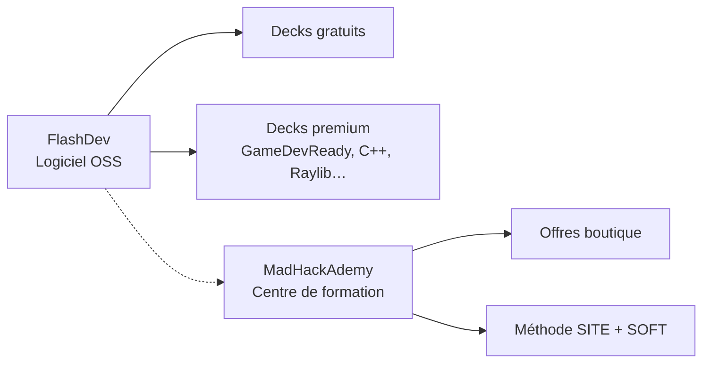

# Note récapitulative — madhackademyWebSite

> Document généré le 17 juin 2026 à partir de l’exploration du dépôt local.

---

## 1. Vue d’ensemble

**madhackademyWebSite** est un site vitrine statique pour l’écosystème **MadHackAdemy** / **FlashDev**. Il présente deux entités complémentaires :

| Entité | Rôle | Fichier |
|--------|------|---------|
| **FlashDev** | Logiciel de flashcards « learn by doing » (open-source + decks premium) | `WebSite/index.html` |
| **MadHackAdemy** | Centre de formation GameDev & coding | `WebSite/centre-formation.html` |

**Dépôt Git :** [github.com/madhackademie/madhackademyWebSite](https://github.com/madhackademie/madhackademyWebSite)  
**Branche :** `main` (1 commit : *Add files via upload*)

---

## 2. Structure du projet

```
madhackademyWebSite/
└── WebSite/
    ├── index.html                 # Page d’accueil FlashDev
    ├── centre-formation.html      # Page centre de formation MadHackAdemy
    └── Image/
        └── MiniPoulpeDicord.png   # Mascotte (page centre-formation)
```

**Constat :** projet très léger — pas de build, pas de framework JS, pas de README, pas de configuration de déploiement.

---

## 3. Stack technique

| Composant | Détail |
|-----------|--------|
| **HTML** | Pages monolithiques (structure + contenu + styles inline) |
| **CSS** | Tailwind CSS via CDN + styles personnalisés dans `<style>` |
| **JavaScript** | Quasi absent sur `index.html` ; `centre-formation.html` utilise un `IntersectionObserver` pour les animations `fade-up` |
| **Assets** | 1 image PNG locale |
| **Hébergement prévu** | Site statique (GitHub Pages, Netlify, ou serveur web classique) |

---

## 4. Identité visuelle (design system commun)

Les deux pages partagent une **charte graphique inspirée Nintendo** :

- **Couleurs :** rouge `#E60012`, jaune `#FBDD08`, vert `#05C31C`, bleu `#1B8CE4`
- **Typo :** `font-mono` (monospace)
- **Fond :** noir avec dégradés gris
- **Effets :** texte en dégradé (`gradient-text`), animations `float`, bordures colorées, boutons style manette ABXY
- **Spécifique centre-formation :** scanlines CRT, animation « MiniPoulpe » (bounce + glow)

---

## 5. Page FlashDev — `index.html`

### État : **contenu largement rempli**

| Section | Contenu |
|---------|---------|
| **Hero** | Slogan « Flashcards by Doing », accroche produit |
| **Problème / Solution** | Comparaison marché actuel vs approche FlashDev (Lua, défis de code) |
| **Modèle économique** | Open-source gratuit + decks premium (GameDevReady, C++, Raylib…) |
| **Roadmap GameDevReady** | 5 modules détaillés (C++, Console-RPG, Raylib, Frogger, POO vs ECS) |
| **Stream** | Section « Stream du samedi soir » avec compte à rebours statique |
| **CTA final** | GitHub + achat decks premium |
| **Navigation** | Accueil, Centre-Formation, Roadmap, Stream |

### Points à compléter / corriger

- Liens externes en `#` : Twitch, YouTube, GitHub, achat premium
- Compte à rebours affiché en dur (« Samedi 20h ») — pas de logique JS dynamique
- Mention de **Lua** dans le contenu alors que la roadmap parle surtout de **C++** / Raylib (cohérence à vérifier)
- Balise `<div class="pt-24">` ouverte ligne 97 **sans balise de fermeture** avant `</body>` (HTML invalide)

---

## 6. Page MadHackAdemy — `centre-formation.html`

### État : **squelette avancé, contenu en placeholder**

La page est structurée comme un **template éditorial** avec de nombreux blocs `[À REMPLIR]` :

| Section | Statut |
|---------|--------|
| **Hero** | Titre OK ; accroche = placeholder |
| **Intro « Qui suis-je ? »** | Début de texte rédigé + paragraphes placeholder + image MiniPoulpe |
| **Méthode** | Description + tableau 2 colonnes (Pilier SITE / Pilier SOFT) = placeholders |
| **Roadmap** | 4 étapes structurées, titres et descriptions = placeholders |
| **Boutique** | 3 offres (standard, phare, premium) = placeholders prix et contenu |
| **Footer** | `[TON NOM / CENTRE DE FORMATION]` |

### Fonctionnalités présentes

- Navigation sticky avec ancres (`#intro`, `#methode`, `#roadmap`, `#boutique`)
- Animations au scroll (`fade-up` + `IntersectionObserver`)
- Lien retour vers FlashDev (`/`)

### Asset manquant potentiel

- Chemin image : `Image\MiniPoulpeDicord.png` (backslash Windows) — le fichier existe dans le dépôt ; préférer `/Image/MiniPoulpeDicord.png` pour la compatibilité web

---

## 7. Navigation inter-pages

```
index.html (FlashDev)
    └── lien → /centre-formation.html

centre-formation.html (MadHackAdemy)
    └── lien → / (FlashDev)
```

Les liens utilisent des chemins absolus (`/`, `/centre-formation.html`), adaptés à un déploiement à la racine du domaine.

---

## 8. Modèle produit (tel que décrit sur le site)



- **FlashDev** : révision active par la pratique (coder pendant qu’on apprend)
- **MadHackAdemy** : formation structurée autour de deux piliers (site web + logiciel/outil)
- **Monétisation envisagée** : vente de decks et offres de formation

---

## 9. Roadmap pédagogique FlashDev (contenu actuel)

| # | Module | Durée indicative |
|---|--------|------------------|
| 1 | Bases C++ (variables, boucles, fonctions…) | 1–2 semaines |
| 2 | Console-RPG (premier projet) | ~1 semaine |
| 3 | Raylib (graphismes, input, audio, collisions) | 2–3 semaines |
| 4 | Frogger Remake (structs, architecture sans POO) | 2–3 semaines |
| 5 | POO vs ECS — choix de paradigme | — |

---

## 10. Recommandations prioritaires

### Contenu
1. Remplir tous les placeholders de `centre-formation.html`
2. Harmoniser le discours Lua / C++ sur `index.html`
3. Rédiger accroche, bio, méthode et fiches boutique

### Technique
1. Fermer la `<div class="pt-24">` sur `index.html`
2. Normaliser les chemins d’images (`/` au lieu de `\`)
3. Remplacer les liens `#` par les URLs réelles (GitHub, Twitch, YouTube, paiement)
4. Implémenter un vrai countdown JS pour le stream (optionnel)

### Projet
1. Ajouter un `README.md` (description, preview locale, déploiement)
2. Envisager un dossier `assets/` ou `css/` si le site grossit
3. Configurer GitHub Pages ou autre hébergeur statique
4. Ajouter favicon, meta SEO (description, Open Graph), analytics si besoin

---

## 11. Lancer en local

Ouvrir directement les fichiers HTML dans un navigateur, ou servir le dossier `WebSite/` :

```powershell
# Exemple avec Python (depuis le dossier WebSite)
python -m http.server 8080
# Puis : http://localhost:8080/
```

> **Note :** avec un serveur local, les liens `/centre-formation.html` peuvent nécessiter d’être servis depuis la racine `WebSite/` pour fonctionner correctement.

---

## 12. Synthèse

| Critère | Évaluation |
|---------|------------|
| **Maturité globale** | Prototype / early stage |
| **Page FlashDev** | ~80 % contenu, liens et détails à finaliser |
| **Page MadHackAdemy** | ~30 % contenu (structure solide, textes à rédiger) |
| **Complexité technique** | Faible — maintenance facile, évolutivité limitée sans refactor |
| **Cohérence visuelle** | Bonne — identité Nintendo partagée entre les deux pages |

Le projet pose une base visuelle cohérente et un positionnement clair (apprentissage par la pratique, GameDev, open-source + premium). La prochaine étape majeure est le **remplissage éditorial** de la page centre de formation et la **mise en ligne** avec les liens fonctionnels.
