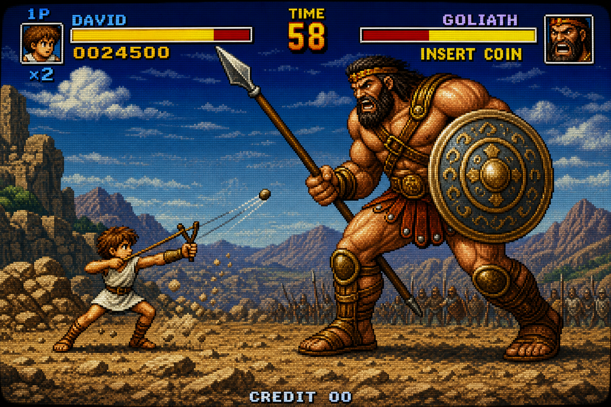

# TODO — madhackademyWebSite

> Dernière mise à jour : 27 juin 2026  
> Projet : site vitrine FlashDev + MadHackAdemy

## Site en production

| Page | URL |
|------|-----|
| Accueil FlashDev | [https://gameopenmoney.com/](https://gameopenmoney.com/) |
| Centre de formation | [https://gameopenmoney.com/centre-formation.html](https://gameopenmoney.com/centre-formation.html) |
| GameDevReady (hub) | [https://gameopenmoney.com/gamedevready.html](https://gameopenmoney.com/gamedevready.html) *(à déployer)* |
| Bases C++ (deck) | [https://gameopenmoney.com/gamedevready-bases-cpp.html](https://gameopenmoney.com/gamedevready-bases-cpp.html) *(à déployer)* |

---

## Tâches prioritaires

Ces tâches débloquent la mise en ligne ou corrigent des problèmes visibles pour les visiteurs.

### Contenu (bloquant publication centre-formation)

- [ ] **P1** — Rédiger l'accroche hero de `centre-formation.html` (1–2 phrases, cible + promesse)
- [ ] **P1** — Compléter la section « Qui suis-je ? » (bio, parcours, placeholders restants)
- [ ] **P1** — Remplir la méthode SITE + SOFT (sous-titre + 3 lignes par pilier)
- [ ] **P1** — Rédiger la roadmap centre-formation (4 étapes : titres, descriptions, durées)
- [ ] **P1** — Définir les 3 offres boutique (noms, contenu, prix, CTA)
- [ ] **P1** — Remplacer `[MadHackAdemy / LOGO]` et le footer `[TON NOM / CENTRE DE FORMATION]`

### Liens & mise en ligne

- [ ] **P1** — Remplacer tous les liens `#` sur `index.html` (GitHub, Twitch, YouTube, achat premium)
- [x] **P1** — Configurer l'hébergement statique → [gameopenmoney.com](https://gameopenmoney.com/)
- [x] **P2** — Vérifier que la navigation inter-pages fonctionne en production (`/` ↔ `/centre-formation.html`)

### Déploiement GameDevReady (provider / FTP)

> Procédure détaillée : **`scripts/NOTE_DEPLOIEMENT-FTP-GAMEDEVREADY.md`** (arborescence FTP, URLs publiques, `URLNet` FlashDev)

- [ ] **P1** — **Mettre à jour chez le provider** : uploader via FTP le contenu de `WebSite/` (pages `gamedevready*.html` + dossier `guides/cards/`)
- [ ] **P1** — Vérifier en production les 7 URLs cartes (`https://gameopenmoney.com/guides/cards/01-printf.html` … `07-struct-methodes.html`)
- [ ] **P1** — Tester le parcours : accueil → Bases C++ → cartes Frogger (iframes + liens plein écran)
- [ ] **P2** — Renseigner `URLNet` dans `FlashRevisionSoft/data.json` avec les URLs HTTPS ci-dessus

### Corrections techniques urgentes

- [x] **P1** — Fermer la balise `
` manquante sur `index.html`
- [ ] **P2** — Normaliser le chemin image MiniPoulpe : `/Image/MiniPoulpeDicord.png` (au lieu de `\`)
- [ ] **P2** — Harmoniser le discours Lua vs C++ sur `index.html` (roadmap = C++/Raylib)

---

## Backlog

Tâches utiles mais non bloquantes — à traiter après les priorités.

### Guides de formation HTML (FlashDev / deck GameDevReady)

> Thème **Frogger** (charte du deck). Sources dans **`FicheFormationHtlm/`** — chaque module a un dossier `ClaudeHtml*`, `ClaudePdf` ou `ClaudeVariableHtml` avec le support HTML de la carte (squelette de base réutilisable).

| Dossier module | Support HTML (URLNet cible) | Carte FlashSoft |
|----------------|----------------------------|-----------------|
| `01_PrintC++` | `ClaudePdf/printfC++FrogTheme.html` | `0x_Print` |
| `02_Variable` | `ClaudeVariableHtml/VariableC++FroggerTheme.html` | `0X_Variable` |
| `03_Conditions` | `ClaudeHtmlConditions/Conditions.html` | `0x_Conditions` |
| `04_Les boucles` | `ClaudeHtml/LoopModule.html` | `0X_Boucles` |
| `05_LibrairieStandard&FonctionsC++` | `ClaudePdf/stdLib&Fonction.html` | `0x_STD_Fonctions` |
| `06_Conteneurs` | `ClaudePdf/Conteneurs.html` | `0X_Conteneurs` |
| `0x_Struct_Methodes` | `FicheFormationHtlm/07_Struct_Methodes/ClaudeHtml/StructMethodes.html` |

- [x] Importer les guides HTML sources dans ce repo (`FicheFormationHtlm/`)
- [x] Carte `07_Struct_Methodes` validée (guide Frogger `Frogger_theme_StrucAndMehtodeCard.html`) — juin 2026
- [x] Cartes Frogger HTML intégrées localement (`WebSite/guides/cards/`, page `gamedevready-bases-cpp.html`) — juin 2026
- [ ] **P1** — Exposer les cartes + pages GameDevReady en production (FTP provider — voir `scripts/NOTE_DEPLOIEMENT-FTP-GAMEDEVREADY.md`)
- [ ] **P1** — Exposer les **guides complets** HTML sous `gameopenmoney.com` (à venir : `printfC++FrogTheme.html`, etc.) — chemins images relatifs à vérifier
- [ ] **P2** — Renseigner `URLNet` dans `FlashRevisionSoft/data.json` pour chaque carte du deck

### Contenu & éditorial

- [ ] Ajouter une page ou section FAQ (méthode, prérequis, durée des formations)
- [ ] Rédiger les textes légaux (mentions légales, CGV boutique)
- [ ] Préparer des témoignages / preuves sociales pour la page centre-formation
- [ ] Aligner la roadmap centre-formation avec celle de FlashDev (`index.html`) ou expliquer la différence

### Technique & UX

- [ ] Implémenter un countdown JS dynamique pour le stream du samedi (`index.html`)
- [ ] Ajouter un favicon et des meta SEO (description, Open Graph, Twitter Card)
- [ ] Extraire les styles communs (charte Nintendo) dans un fichier CSS partagé
- [ ] Remplacer Tailwind CDN par une build locale (perf + offline)
- [ ] Ajouter un menu mobile responsive (hamburger) sur les deux pages
- [ ] Corriger le titre `<title>` : `[MadHackAdemy]` → nom définitif

### Projet & maintenance

- [ ] Rédiger un `README.md` (description, preview locale, déploiement)
- [ ] Structurer un dossier `assets/` ou `css/` si le site grossit
- [ ] Configurer analytics (Plausible, GA4…) si souhaité
- [ ] Mettre en place un workflow de preview (PR previews Netlify/Vercel)
- [ ] Ajouter des tests de régression visuelle ou lint HTML (optionnel)

### Deck GameDevReady (coordination avec FlashRevisionSoft)

- [ ] **P2** — Mettre à jour la roadmap site : Premier Challenge → David & Goliath (combat tour par tour) une fois le projet créé côté soft
- [ ] **polish** — *(repo FlashRevisionSoft)* Branche `polish/cards-webm` : rendu hybride image/vidéo via `mediaType` optionnel (`"image"` par défaut, WebM pour cartes animées officielles) — détail dans `FlashRevisionSoft/TODO.md` — pas urgent

### Évolutions produit

#### Gamification — duels pixel art (FlashDev)

> Backlog fonctionnel pour le soft FlashRevisionSoft. Chaque révision de carte devient un combat ; la progression RPG motive la répétition espacée.

**Référence visuelle — David vs Goliath**

Maquette d’écran cible (beat’em up arcade type *Golden Axe* / *Cadillacs and Dinosaurs*) :

| Élément à l’écran | Rôle dans FlashDev |
|-------------------|-------------------|
| **David** (1P, petit avatar) | L’élève — avatar joueur personnalisable |
| **Goliath** (boss, barre rouge) | Ennemi de la carte — difficulté élevée, plusieurs « attaques » (révisions) pour le vaincre |
| **Barre jaune 1P** | HP de l’élève (streak / survie entre sessions) |
| **Score `0024500`** | XP cumulée |
| **Barre rouge boss** | HP restant du boss — diminue à chaque révision réussie |
| **TIME** | Optionnel — pression douce ou limite par session |

*David contre Goliath* = métaphore produit : une carte difficile n’est pas un mur, c’est un duel gagnable coup par coup (révision par révision).

**Concept général**

- [ ] Avatar joueur personnalisable (sprite pixel art) affiché pendant les sessions de révision
- [ ] À chaque révision de carte : déclencher un **duel pixel art** contre l’ennemi associé à la carte
- [ ] Chaque carte porte un **type d’ennemi** (sprite dédié) et un **niveau de difficulté**
- [ ] Hiérarchie d’ennemis : **mob** (carte standard) → **mini-boss** (cartes clés / modules) → **boss** (fin de chapitre / deck)
- [ ] Victoire au duel → récompenses : **XP** (progression globale) + **HP** (ressource de survie / streak)
- [ ] Boss : **plusieurs attaques** (plusieurs révisions réussies de cartes liées) nécessaires pour le vaincre — barre de vie multi-étapes

**À spécifier / découper**

- [ ] Modèle de données carte ↔ ennemi (type, difficulté, HP ennemi, XP/HP gagnés)
- [ ] Règles de défaite (mauvaise réponse = dégâts subis par l’avatar ? perte de HP ?)
- [ ] Écran de duel (animations attaque joueur / ennemi, feedback victoire-défaite)
- [ ] Banque de sprites pixel art (avatar, mobs, mini-boss, boss par thème deck)
- [ ] Persistance locale : XP, HP courants, boss en cours (HP restant entre sessions)
- [ ] Sync optionnelle vers le site (voir `NOTE_ARCHITECTURE_SOFT-SITE.md`) pour afficher progression RPG en ligne

**Références produit**

- Révision = attaque (fronde / coup) ; boss = objectif long terme nécessitant N révisions réussies
- Métaphore **David vs Goliath** : l’élève (petit mais équipé) affronte des ennemis bien plus imposants
- Direction artistique : pixel art arcade 16-bit, HUD avec barres HP/XP — voir image ci-dessus
- Cohérent avec l’identité GameDev / pixel art du projet MadHackAdemy

---

- [ ] Intégrer un système de paiement pour les decks premium (Stripe, Gumroad…)
- [ ] Page dédiée par offre boutique avec landing optimisée conversion
- [ ] Formulaire de contact ou inscription newsletter
- [ ] Version anglaise du site (i18n)

---

## Légende priorités

| Tag | Signification |
|-----|---------------|
| **P1** | Critique — à faire en premier |
| **P2** | Important — rapidement après P1 |
| **polish** | Amélioration visuelle / UX — non bloquant |
| *(backlog)* | Amélioration — quand le site est en ligne et le contenu rempli |

---

## État rapide du projet

| Page | Avancement estimé |
|------|---------------------|
| `index.html` (FlashDev) | ~80 % — contenu OK, liens et détails à finaliser |
| `centre-formation.html` | ~30 % — structure solide, contenu à rédiger |
| `gamedevready-bases-cpp.html` | ~70 % — deck cartes OK en local, déploiement FTP à faire |
