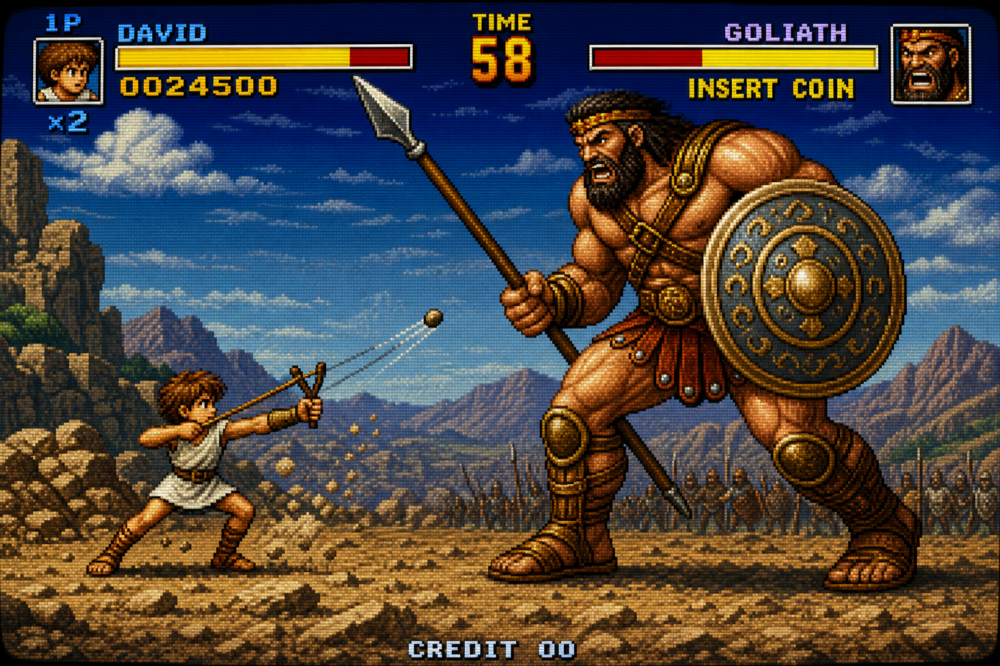

# TODO — madhackademyWebSite

> Dernière mise à jour : 20 juillet 2026  
> Projet : site vitrine FlashDev + MadHackAdemy

---

## Prochaine session de travail

> **P0 + auth OVH terminés (juillet 2026)** — `Formations/BaseCpp/`, déploiement FTP, tests production, beta testeurs.

> Guide session : [`scripts/NOTE_PROCHAINE-SESSION.md`](scripts/NOTE_PROCHAINE-SESSION.md)

| Doc | Sujet |
|-----|--------|
| [`scripts/NOTE_PROCHAINE-SESSION.md`](scripts/NOTE_PROCHAINE-SESSION.md) | État projet, architecture, prochaines évolutions |
| [`scripts/NOTE_SYSTEMEIO-API-FLASHDEV.md`](scripts/NOTE_SYSTEMEIO-API-FLASHDEV.md) | **P1** — API Systeme.io → opt-in FlashDev (tuto étapes 1–7) |
| [`scripts/NOTE_DEPLOIEMENT-FTP-GAMEDEVREADY.md`](scripts/NOTE_DEPLOIEMENT-FTP-GAMEDEVREADY.md) | FTP GameDevReady |
| [`scripts/NOTE_OVH-PHP-MYSQL.md`](scripts/NOTE_OVH-PHP-MYSQL.md) | PHP, MySQL, auth OVH (maintenance) |
| [`scripts/NOTE_AUTH-SETUP.md`](scripts/NOTE_AUTH-SETUP.md) | Rôles, URLs auth |
| [`scripts/NOTE_CREATION-ENTREPRISE.md`](scripts/NOTE_CREATION-ENTREPRISE.md) | Création entreprise Allemagne, N26, calendrier sept. 2026 |
| [`scripts/NOTE_REVISION-BOOTCAMP-FR.md`](scripts/NOTE_REVISION-BOOTCAMP-FR.md) | Checklist révision cartes + guides FR + test soft (P1) |
| [`scripts/NOTE_MVP-FLASHDEV.md`](scripts/NOTE_MVP-FLASHDEV.md) | Périmètre MVP avant release — à valider |

### Checklist rapide prochaine session

**Priorité P1 :** API Systeme.io → formulaire opt-in sur FlashDev (site) — voir ci-dessous + note dédiée.

---

| Page | URL |
|------|-----|
| Accueil FlashDev | [https://gameopenmoney.com/](https://gameopenmoney.com/) |
| Centre de formation | [https://gameopenmoney.com/centre-formation.html](https://gameopenmoney.com/centre-formation.html) |
| GameDevReady (hub) | [https://gameopenmoney.com/gamedevready.html](https://gameopenmoney.com/gamedevready.html) |
| Bases C++ (deck) | [https://gameopenmoney.com/gamedevready-bases-cpp.html](https://gameopenmoney.com/gamedevready-bases-cpp.html) |
| Guides (01–07) | `Formations/BaseCpp/guides/*Guide/` via `/auth/guide.php?m=01` … `m=07` |

---

## P0 — Réorganisation `WebSite/Formations/` ✅ (juillet 2026)

> **Terminé** — séparation cartes / guides sous le parcours **BaseCpp**. L’ancien dossier `WebSite/guides/` a été supprimé.

### Arborescence actuelle

```
WebSite/Formations/
└── BaseCpp/                        ← parcours C++ fondamentaux (deck GameDevReady)
    ├── cards/                      ← cartes Frogger (publiques)
    │   ├── 01-printf.html … 06-conteneurs.html
    │   └── 07_StructMethode_Card/07-struct-methodes-card.html
    └── guides/                     ← guides pédagogiques (protégés)
        ├── 01_PrintFGuide/ … 07_StructMethodesGuide/
        └── .htaccess               ← bloque accès direct aux .html
```

> **Évolution future** — autres parcours au même niveau : `Formations/Unreal/`, `Formations/SDL/`, etc.  
> Option ultérieure : sous-dossiers par module `{NN}_{nom}/guide/` + `card/` (voir backlog P3).

### Correspondance modules (01 → 07)

| Module | Carte publiée | Guide protégé |
|--------|---------------|---------------|
| 01 | `cards/01-printf.html` | `guides/01_PrintFGuide/printfC++FrogTheme.html` |
| 02 | `cards/02-variables.html` | `guides/02_VariableGuide/VariableC++FroggerTheme.html` |
| 03 | `cards/03-conditions.html` | `guides/03_ConditionsGuide/Conditions.html` |
| 04 | `cards/04-boucles.html` | `guides/04_BouclesGuide/LoopModule.html` |
| 05 | `cards/05-std-fonctions.html` | `guides/05_StdFonctionsGuide/stdLib&Fonction.html` |
| 06 | `cards/06-conteneurs.html` | `guides/06_ConteneursGuide/Conteneurs.html` |
| 07 | `cards/07_StructMethode_Card/07-struct-methodes-card.html` | `guides/07_StructMethodesGuide/StructMethodes.html` |

**Sources éditoriales** : `FicheFormationHtlm/{module}/*Guide/` → recopier vers `WebSite/Formations/BaseCpp/`.

**Fichiers mis à jour**

- [x] `gamedevready-bases-cpp.html`, `api/bootstrap.php`
- [x] `FlashRevisionSoft/SquelletteGCS/data.json` (`URLNet`)
- [x] Notes FTP, auth, prochaine session

**Checklist réorganisation**

- [x] **P0** — Créer `WebSite/Formations/BaseCpp/cards/` + `guides/`
- [x] **P0** — Déplacer HTML + `Image/` des 7 modules
- [x] **P0** — Mettre à jour iframes, `bootstrap.php`, `URLNet`, documentation
- [x] **P0** — Re-upload FTP `Formations/BaseCpp/` ; retirer anciens chemins serveur — juillet 2026
- [ ] **P3** — Sous-dossiers par module `{NN}_{nom}/guide/` + `card/` *(optionnel, si besoin)*
- [ ] **P3** — Extension `Formations/Unreal/`, `Formations/SDL/` sur le même modèle

---

## Tâches prioritaires

> **Priorité actuelle : P1** — compte + acquis (login / MDP) ; puis paiement formation.

Ces tâches débloquent la mise en ligne ou corrigent des problèmes visibles pour les visiteurs.

### Compte + acquis / droits (**P1** — prochaine session)

> Problème : sans l’email `?dl=1`, l’élève ne peut plus rouvrir le download.  
> Détail : [`scripts/NOTE_PROCHAINE-SESSION.md`](scripts/NOTE_PROCHAINE-SESSION.md)

- [ ] **P1** — Création / login compte site avec **mot de passe** (lier à l’email opt-in si possible)
- [ ] **P1** — Modèle d’**acquisitions** (ex. `flashdev-soft`, formation bootcamp…) stocké côté site
- [ ] **P1** — Verrouiller les contenus selon acquis :
  - soft seul → **download FlashDev + site vitrine** ; **pas** de webGuide
  - formation payante → + guides (`student` / `user_products`)
- [ ] **P1** — `flashdev.html` : accès download si session + acquis soft (réduire la dépendance à `?dl=1`)
- [ ] **P1** — Ensuite : **paiement** → acquisition formation

### Domaine madhackademy.eu + email (**P1**)

- [x] **P1** — Boîte mail OVH `contact@madhackademy.eu` (envoi + réception)
- [x] **P1** — Auth domaine Systeme.io (DNS OK, domaine validé 2/08)
- [x] **P1** — Liens soft + release 0.2.2 → `madhackademy.eu`
- [x] **P1** — Redirect 301 `gameopenmoney.com` → `madhackademy.eu` (`.htaccess`, validé 2/08)

### Opt-in téléchargement FlashDev + API Systeme.io (**P1**)

> Tuto : **[`scripts/NOTE_SYSTEMEIO-API-FLASHDEV.md`](scripts/NOTE_SYSTEMEIO-API-FLASHDEV.md)**

- [x] **P1** — Clé API Systeme.io + test `curl` (contact visible)
- [x] **P1** — Tag `flashdev-download` + automation email + tag API PHP (2/08)
- [x] **P1** — Endpoint PHP `api/systeme-optin.php` (clé dans `config.php` FTP uniquement)
- [x] **P1** — Formulaire opt-in sur page FlashDev (design site / cadre SNES) → POST vers l’endpoint
- [x] **P1** — Test prod bout en bout : submit → contact → tag → email → lien (2/08)
- [x] **P2** — Aligner `flashdev.html` (gate login / formulaire site, plus de lien Systeme.io externe)

### Pages vitrine — validation contenu & liens (**P1**)

> Cocher la page principale quand **contenu + liens** sont validés. Détail des liens `#` restants : voir grep `href="#"` dans chaque fichier.

- [ ] **P1** — [`index.html`](WebSite/index.html) (FlashDev — accueil)
  - [ ] Contenu validé (hero, comparaison, roadmap, stream, download)
  - [ ] Tous les liens réels — GitHub, Twitch, YouTube, System.io, achat premium (plus de `href="#"`)
- [ ] **P1** — [`centre-formation.html`](WebSite/centre-formation.html) (MadHackAdemy)
  - [ ] Contenu validé — hero, qui suis-je, méthode SITE+SOFT, roadmap, boutique (3 offres), footer
  - [ ] Tous les liens réels — CTA offres, nav, ancres (plus de placeholders `[…]` ni `href="#"`)
- [ ] **P1** — [`gamedevready.html`](WebSite/gamedevready.html) (hub GameDevReady)
  - [ ] Contenu validé — 3 phases, textes phases 2–3 « à venir »
  - [ ] Tous les liens réels — deck Bases C++, roadmap accueil, nav inter-pages

### Contenu (bloquant publication centre-formation)

- [ ] **P1** — Rédiger l'accroche hero de `centre-formation.html` (1–2 phrases, cible + promesse)
- [ ] **P1** — Compléter la section « Qui suis-je ? » (bio, parcours, placeholders restants)
- [ ] **P1** — Remplir la méthode SITE + SOFT (sous-titre + 3 lignes par pilier)
- [ ] **P1** — Rédiger la roadmap centre-formation (4 étapes : titres, descriptions, durées)
- [ ] **P1** — Définir les 3 offres boutique (noms, contenu, prix, CTA)
- [ ] **P1** — Remplacer `[MadHackAdemy / LOGO]` et le footer `[TON NOM / CENTRE DE FORMATION]`

### Liens & mise en ligne

- [ ] **P1** — Remplacer tous les liens `#` sur `index.html` (GitHub, Twitch, YouTube, achat premium)
- [x] **P1** — Configurer l'hébergement statique → [gameopenmoney.com](https://gameopenmoney.com/)
- [x] **P2** — Vérifier que la navigation inter-pages fonctionne en production (`/` ↔ `/centre-formation.html`)

### Révision bootcamp FR + test soft — **P1**

> Checklist détaillée (une case par carte / guide / module soft) : **`scripts/NOTE_REVISION-BOOTCAMP-FR.md`**

- [ ] **P1** — Révision site : 7 cartes HTML + 7 guides FR (cohérence, images, liens)
- [ ] **P1** — Test soft : install `DeckBootCampCpp/` + parcours complet sur les 7 cartes
- [ ] **P1** — Re-upload FTP après corrections

### Mise à jour FlashDev (coordination site ↔ soft)

> Workflow update : **`FlashRevisionSoft/scripts/NOTE_UPDATE-WORKFLOW.md`**

- [x] **P1** — Manifest + zip sur FTP (`WebSite/flashdev/`)
- [x] **P1** — Procédure release documentée (`build-release-zip.ps1`)

### Prochaine session — **P1** première version téléchargeable (site + soft)

> Installeur **sans deck** (Love2D + VS Code) · decks = achat + download site · test bout en bout avec bootcamp C++ en deck payant séparé — voir `FlashRevisionSoft/TODO.md`

- [ ] **P1** — Installeur plateforme hébergé sur `flashdev/` (distinct zip update + distinct packages decks payants)
- [ ] **P1** — Bouton **Télécharger FlashDev** sur `dashboard/index.php` (soft gratuit ou inclus compte)
- [ ] **P1** — Parcours boutique : achat deck → téléchargement → install `deckInstaller` → bootcamp C++ utilisable
- [ ] **P1** — Test machine vierge : install socle seul → puis deck acheté téléchargé depuis le site

### Déploiement GameDevReady (provider / FTP)

> Procédure détaillée : **`scripts/NOTE_DEPLOIEMENT-FTP-GAMEDEVREADY.md`**

- [x] **P1** — Réorganisation locale `Formations/BaseCpp/` + chemins code — juillet 2026
- [x] **P1** — Upload FTP `gamedevready-bases-cpp.html` + `Formations/BaseCpp/` — juillet 2026
- [x] **P1** — Vérifier en production les 7 cartes + accès guides via `/auth/guide.php?m=01` … `m=07` — juillet 2026
- [x] **P1** — Tester le parcours : Bases C++ → miniature → carte → **Ouvrir le guide** — juillet 2026
- [x] **P2** — Renseigner `URLNet` dans `FlashRevisionSoft/data.json` avec les URLs HTTPS

### Auth — guides protégés (admin / testeurs)

> Détail : **`scripts/NOTE_AUTH-SETUP.md`**

- [x] Code auth PHP local (`api/`, `auth/`, `sql/schema.sql`) — juin 2026
- [x] Boutons guide → `/auth/guide.php?m=XX` sur `gamedevready-bases-cpp.html`
- [x] 7 guides publiés dans `WebSite/Formations/BaseCpp/guides/*Guide/`
- [x] Auth déployée en production OVH (PHP, MySQL, FTP, comptes, `setup.php` retiré) — juillet 2026
- [x] Tests production (login, guides 01–07, 403 URL directe) — juillet 2026
- [x] Identifiants testeurs beta distribués — juillet 2026
- [ ] **P2** — Webhook paiement → accès `student` (`user_products`)

### Espace utilisateur — `dashboard/` (avant commercialisation bootcamp)

> Nom prévu : **`WebSite/dashboard/index.php`** — espace élève (`NOTE_ARCHITECTURE_SOFT-SITE.md`).

- [ ] **P1** — Créer `dashboard/index.php` : page connectée post-login avec
  - guides d'installation et d'utilisation de FlashRevisionSoft
  - fichiers utilitaires à télécharger
  - contenu déjà acheté (decks, accès guides GameDevReady)
  - **bouton télécharger l'installeur** (lien vers script/exe — à créer après validation MVP, voir `NOTE_INSTALL-MADHACKADEMY.md`)
- [ ] **P1** — Lien depuis la nav auth (`login.php`, `gamedevready-bases-cpp.html`) vers le dashboard

### Corrections techniques urgentes

- [x] **P1** — Fermer la balise `<div class="pt-24">` manquante sur `index.html`
- [ ] **P2** — Normaliser le chemin image MiniPoulpe : `/Image/MiniPoulpeDicord.png` (au lieu de `\`)
- [ ] **P2** — Harmoniser le discours Lua vs C++ sur `index.html` (roadmap = C++/Raylib)
- [ ] **P2** — Roadmaps `index.html` / `centre-formation.html` : barrer ou marquer les vignettes des modules non prêts (2–5) en **« À venir »** / **en construction**, sur le modèle des phases 2–3 de `gamedevready.html` (badge `À VENIR`, `opacity-75`, bordure grise, « Bientôt disponible », pas de lien) — seul **Bases C++** reste cliquable

---

## Backlog

Tâches utiles mais non bloquantes — à traiter après les priorités.

### Guides de formation HTML (FlashDev / deck GameDevReady)

> Thème **Frogger** (charte du deck). Guides pédagogiques dans **`FicheFormationHtlm/{module}/*Guide/`** — cartes et guides publiés dans **`WebSite/Formations/BaseCpp/`**.

| Dossier module | Guide HTML | Carte FlashSoft |
|----------------|------------|-----------------|
| `01_PrintC++` | `01_PrintFGuide/printfC++FrogTheme.html` | `0x_Print` |
| `02_Variable` | `02_VariableGuide/VariableC++FroggerTheme.html` | `0X_Variable` |
| `03_Conditions` | `03_ConditionsGuide/Conditions.html` | `0x_Conditions` |
| `04_Les boucles` | `04_BouclesGuide/LoopModule.html` | `0X_Boucles` |
| `05_LibrairieStandard&FonctionsC++` | `05_StdFonctionsGuide/stdLib&Fonction.html` | `0x_STD_Fonctions` |
| `06_Conteneurs` | `06_ConteneursGuide/Conteneurs.html` | `0X_Conteneurs` |
| `07_Struct_Methodes` | `07_StructMethodesGuide/StructMethodes.html` | `0x_Struct_Methodes` |

- [x] Importer les guides HTML sources dans ce repo (`FicheFormationHtlm/`)
- [x] Carte `07_Struct_Methodes` validée (guide Frogger `Frogger_theme_StrucAndMehtodeCard.html`) — juin 2026
- [x] Cartes Frogger HTML intégrées (`WebSite/Formations/BaseCpp/cards/`, page `gamedevready-bases-cpp.html`) — juillet 2026
- [x] Guides 01–07 dans `WebSite/Formations/BaseCpp/guides/` — juillet 2026
- [x] Structure `FicheFormationHtlm/*Guide/` (sources, sans HTML carte) — juin 2026
- [x] Page Bases C++ : miniatures → ancres, boutons guide protégés — juin 2026

#### Protection anti-copie (guides Frogger + futurs Raylib C++)

> **Déjà en place (bootcamp 01–07)** : auth `/auth/guide.php` + blocage `.htaccess` sur `guides/` (403 en accès direct).  
> **Réaliste** : empêcher la consultation sans achat / compte. **Impossible à 100 %** : une fois affiché, le HTML reste copiable (DevTools, « Enregistrer sous », capture). Objectif = **friction + récupération commerciale**, pas un DRM inviolable.  
> **Cartes Frogger** = volontairement **publiques** (vitrine) ; **guides pédagogiques** = **protégés**.

**Checklist à appliquer à chaque nouveau guide GameDevReady** (bootcamp + modules Raylib avancés) :

- [ ] Déposer le HTML dans `WebSite/Formations/BaseCpp/guides/*Guide/` (ne jamais publier le guide en URL publique directe)
- [ ] Enregistrer le module dans `mha_guides_catalog()` (`WebSite/api/bootstrap.php`)
- [ ] Bouton « Ouvrir le guide » → `/auth/guide.php?m=XX` sur la page deck (pas de lien vers le `.html`)
- [ ] Vérifier après FTP : accès direct `…/guides/…/*.html` → **403** (`.htaccess` uploadé)
- [ ] Footer du guide : © MadHackAdemy / GameDevReady + **encart lien officiel de vente** du deck (CTA boutique — lecteur pirate retombe sur ton site)
- [ ] Côté soft : `URLNet` pointe la **carte publique** (`cards/…`) — **pas** le guide ni `/auth/guide.php`
- [ ] **P2** — *(optionnel, polish)* Filigrane discret (email ou pseudo de session) injecté par `mha_serve_guide_html()` — dissuasion partage de compte
- [ ] **P2** — *(ne pas prioriser)* `user-select: none` / blocage clic droit — contournable, UX dégradée ; ne remplace pas l'auth

### Contenu & éditorial
- [ ] Rédiger les textes légaux (mentions légales, CGV boutique) — voir [`scripts/NOTE_CREATION-ENTREPRISE.md`](scripts/NOTE_CREATION-ENTREPRISE.md)
- [ ] Préparer des témoignages / preuves sociales pour la page centre-formation
- [ ] Aligner la roadmap centre-formation avec celle de FlashDev (`index.html`) ou expliquer la différence

### Technique & UX

- [ ] Implémenter un countdown JS dynamique pour le stream du samedi (`index.html`)
- [ ] Ajouter un favicon et des meta SEO (description, Open Graph, Twitter Card)
- [ ] Extraire les styles communs (charte Nintendo) dans un fichier CSS partagé
- [ ] Remplacer Tailwind CDN par une build locale (perf + offline)
- [ ] Ajouter un menu mobile responsive (hamburger) sur les deux pages
- [ ] Corriger le titre `<title>` : `[MadHackAdemy]` → nom définitif

### Projet & maintenance

- [ ] Rédiger un `README.md` (description, preview locale, déploiement)
- [ ] Structurer un dossier `assets/` ou `css/` si le site grossit
- [ ] Configurer analytics (Plausible, GA4…) si souhaité
- [ ] Mettre en place un workflow de preview (PR previews Netlify/Vercel)
- [ ] Ajouter des tests de régression visuelle ou lint HTML (optionnel)

### Deck GameDevReady (coordination avec FlashRevisionSoft)

- [ ] **P2** — Mettre à jour la roadmap site : Premier Challenge → David & Goliath (combat tour par tour) une fois le projet créé côté soft
- [ ] **polish** — *(repo FlashRevisionSoft)* Branche `polish/cards-webm` : rendu hybride image/vidéo via `mediaType` optionnel (`"image"` par défaut, WebM pour cartes animées officielles) — détail dans `FlashRevisionSoft/TODO.md` — pas urgent

### Évolutions produit

#### Gamification — duels pixel art (FlashDev)

> Backlog fonctionnel pour le soft FlashRevisionSoft. Chaque révision de carte devient un combat ; la progression RPG motive la répétition espacée.

**Référence visuelle — David vs Goliath**

Maquette d’écran cible (beat’em up arcade type *Golden Axe* / *Cadillacs and Dinosaurs*) :




| Élément à l’écran | Rôle dans FlashDev |
|-------------------|-------------------|
| **David** (1P, petit avatar) | L’élève — avatar joueur personnalisable |
| **Goliath** (boss, barre rouge) | Ennemi de la carte — difficulté élevée, plusieurs « attaques » (révisions) pour le vaincre |
| **Barre jaune 1P** | HP de l’élève (streak / survie entre sessions) |
| **Score `0024500`** | XP cumulée |
| **Barre rouge boss** | HP restant du boss — diminue à chaque révision réussie |
| **TIME** | Optionnel — pression douce ou limite par session |

*David contre Goliath* = métaphore produit : une carte difficile n’est pas un mur, c’est un duel gagnable coup par coup (révision par révision).

**Concept général**

- [ ] Avatar joueur personnalisable (sprite pixel art) affiché pendant les sessions de révision
- [ ] À chaque révision de carte : déclencher un **duel pixel art** contre l’ennemi associé à la carte
- [ ] Chaque carte porte un **type d’ennemi** (sprite dédié) et un **niveau de difficulté**
- [ ] Hiérarchie d’ennemis : **mob** (carte standard) → **mini-boss** (cartes clés / modules) → **boss** (fin de chapitre / deck)
- [ ] Victoire au duel → récompenses : **XP** (progression globale) + **HP** (ressource de survie / streak)
- [ ] Boss : **plusieurs attaques** (plusieurs révisions réussies de cartes liées) nécessaires pour le vaincre — barre de vie multi-étapes

**À spécifier / découper**

- [ ] Modèle de données carte ↔ ennemi (type, difficulté, HP ennemi, XP/HP gagnés)
- [ ] Règles de défaite (mauvaise réponse = dégâts subis par l’avatar ? perte de HP ?)
- [ ] Écran de duel (animations attaque joueur / ennemi, feedback victoire-défaite)
- [ ] Banque de sprites pixel art (avatar, mobs, mini-boss, boss par thème deck)
- [ ] Persistance locale : XP, HP courants, boss en cours (HP restant entre sessions)
- [ ] Sync optionnelle vers le site (voir `NOTE_ARCHITECTURE_SOFT-SITE.md`) pour afficher progression RPG en ligne

**Références produit**

- Révision = attaque (fronde / coup) ; boss = objectif long terme nécessitant N révisions réussies
- Métaphore **David vs Goliath** : l’élève (petit mais équipé) affronte des ennemis bien plus imposants
- Direction artistique : pixel art arcade 16-bit, HUD avec barres HP/XP — voir image ci-dessus
- Cohérent avec l’identité GameDev / pixel art du projet MadHackAdemy

---

- [ ] Intégrer un système de paiement pour les decks premium (Stripe, Gumroad…)
- [ ] Page dédiée par offre boutique avec landing optimisée conversion
- [ ] Formulaire de contact ou inscription newsletter
- [ ] Version anglaise du site (i18n)

---

## Légende priorités

| Tag | Signification |
|-----|---------------|
| **P0** | Réorganisation `Formations/BaseCpp/` + auth OVH — **fait** (juillet 2026) |
| **P1** | Critique — contenu centre-formation |
| **P2** | Important — rapidement après P1 |
| **polish** | Amélioration visuelle / UX — non bloquant |
| *(backlog)* | Amélioration — quand le site est en ligne et le contenu rempli |

---

## État rapide du projet

| Page | Avancement estimé |
|------|---------------------|
| `index.html` (FlashDev) | ~80 % — contenu OK, liens et détails à finaliser ; modules roadmap 2–5 à marquer « à venir » |
| `centre-formation.html` | ~30 % — structure solide, contenu à rédiger |
| `gamedevready-bases-cpp.html` | ~100 % — deck + guides + auth en prod, tests OK |
